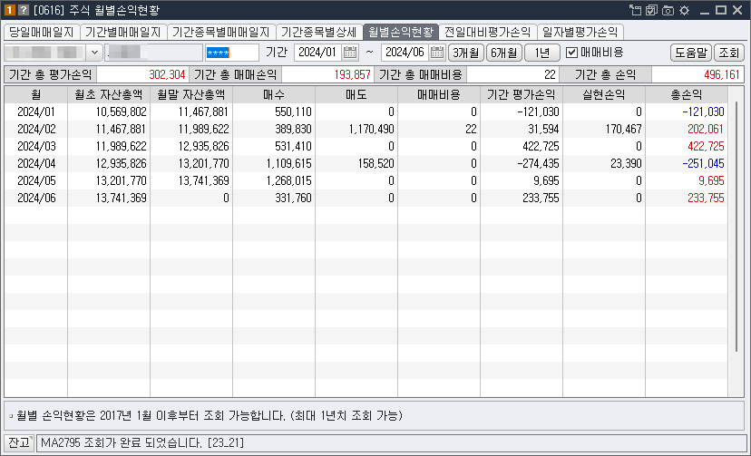
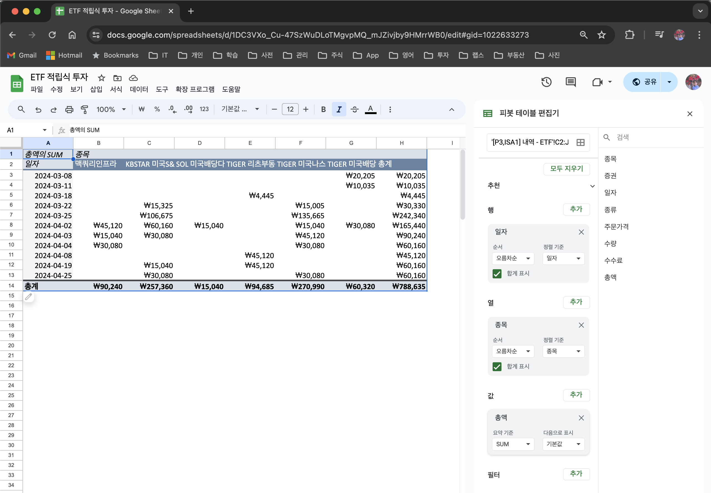
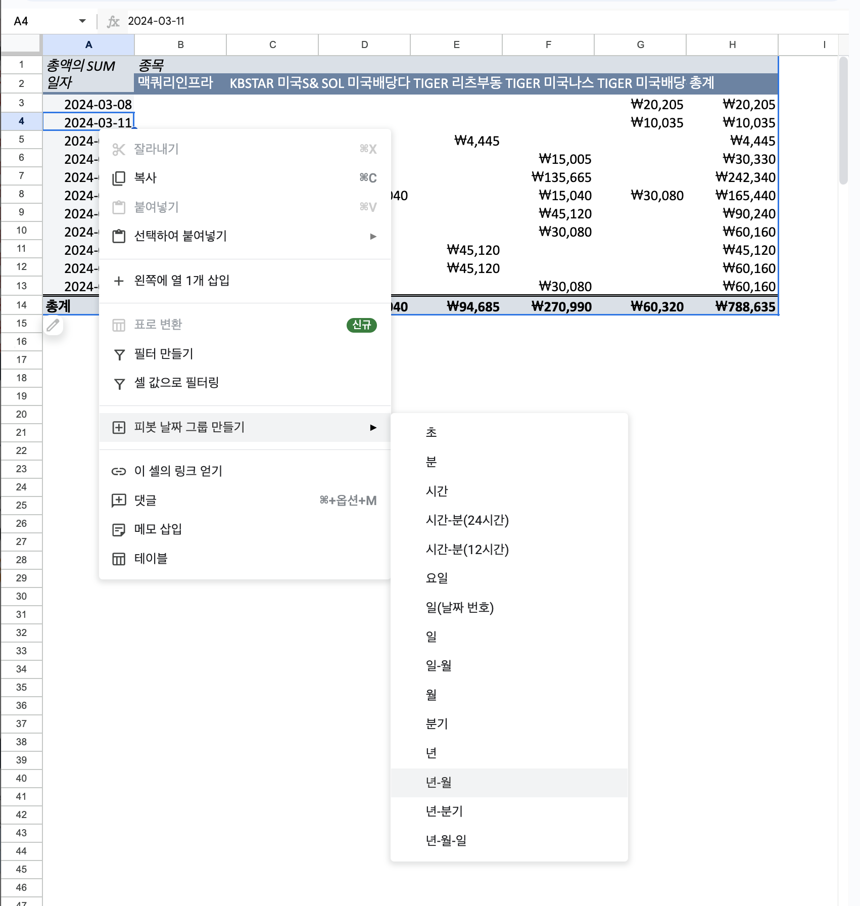

# 1. 개요

여러 계좌에서 여러 주식을 매수하다 보면, 내가 얼마나 매수했는지 감이 오지 않을 때가 있다. 사람마다 투자 스타일이 다르겠지만, 개인적으로는 구체적인 매매 전략을 세우고 정확한 투자 금액을 정하지 않는 편이다. 또한, 한 번에 모든 주식을 사지 않고 분할 매수를 하며 가격이 더 내려간 주식을 추가로 매수하다 보니 시간이 지나면 내가 얼마나 매수했는지 알기 어렵다.

저와 비슷한 스타일로 매수하는 분들에게 오늘 포스팅하는 내용이 도움이 되기를 바란다. 매달 내가 매수한 금액을 어떻게 확인할 수 있는지 알아보자.

# 2. 월별 투자 금액 확인하는 방법

## 2.1 HTS 에서 확인하는 방법

HTS에서는 `0616` 주식 월별손익현황로 확인이 가능하다. 월별로 내가 매수, 매도한 금액을 쉽게 확인할 수 있고 매매 수수료도 확인 가능하다.

## 2.2 구글 시트에서 피봇 테이블 만드는 방법

다른 방법으로는 직접 수동으로 확인하는 것이다. 개인적으로 매매 내역을 구글 시트로 관리하고 있다. 번거로운 작업이지만, 이렇게 하는 이유는 구글 시트 내에서 관심 종목을 만들고 매수 및 매도 종목을 정리하면서 내 주식에 관심을 더 가지기 위해서다. 또한 부족한 부분을 스터디하는 목적도 크다. 내가 무엇을 하고 있는지 명확히 알 수 있기 때문에 이렇게 하고 있다.

매매일지를 아래와 같이 구글 시트에서 작성하고 있다면, 피봇 테이블을 이용해 매월 어떤 종목을 매수했는지 확인할 수 있다.

메뉴에서 `삽입` > `피봇 테이블` 을 클릭하면 아래와 같이 `피봇 테이블 만들기` 창이 뜬다. 새 시트로 생성한다.

`피봇 테이블 편집기`에서 행에는 `일자`를 추가하고 열은 `종목`, 그리고 값은 `총액`을 선택한다.

우리가 원하는 건 월별로 총금액을 알고 싶은 거라서 날짜 중에 아무거나 우클릭해서 `피봇 날짜 그룹 만들기` > `년-월` 을 선택한다.

아래와 같이 월별로 종목마다 총 금액을 확인할 수 있다.

# 3. 정리

샘플로 생성한 피봇 테이블은 여기 [링크](https://docs.google.com/spreadsheets/d/1DC3VXo_Cu-47SzWuDLoTMgvpMQ_mJZivjby9HMrrWB0/edit?usp=sharing)에서 확인할 수 있다. 개인적으로, 분기별로 관심 종목을 다시 만들고 회고한 후 투자 계획을 다시 세우는 편이다. 한 분기 동안 어떻게 투자를 진행했는지 쉽게 알 수 있어서, 다음 분기에는 투자 비율을 어떻게 가져갈지 더 전략적으로 결정할 수 있는 듯하다.