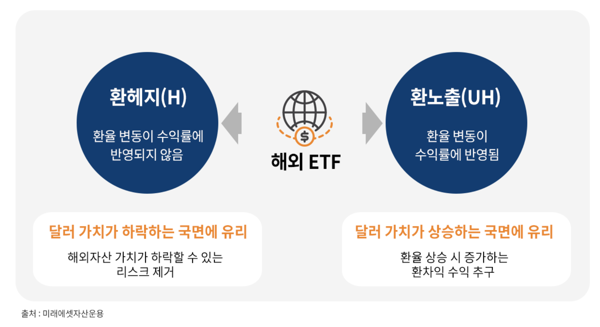

## 1. 환헤지(H), 환노출(UH)란?

ETF의 상품명을 보면 H가 붙어 있는 것을 볼 수 있다. H는 `Hedge`(헤지, 방지)의 약자로, 환율에 영향을 받지 않는 상품이다. 국내 ETF의 경우에는 모든 종목이 원화로 거래되기 때문에 H 개념이 존재하지 않고 해외 상품에만 붙게 된다. H가 붙지 않는 상품은 UH(UnHedge) `환노출` 상품으로 환율의 상승/하락이 그대로 수익에 반영이 된다.

- `환헤지` (H)
  - ex. `379780` RISE 미국S&P500
  - 환율 변동으로 인한 손실을 줄이기 위해 미리 환율을 고정시키는 정략이다.
  - 환혜지 상품의 경우 환율을 헤지하는 과정에서 수수료가 발생하여 일반적으로 운용보수가 환노출상품보다 높다
- `환노출` (UH)
  - ex. `453330` RISE 미국S&P500(H)
  - 환율 변동의 리스크를 그대로 노출된다. 환율이 상승하면 추가 수익을 얻을 수 있지만, 반대로 환율이 하락하면 손실을 볼 수도 있다.

## 2. 금리 인하시 `환노출`, `환헤지` ETF 상품중 어느 상품이 더 유리할까?

미국의 금리가 인하되면, 일반적으로 그 나라의 통화 가치가 하락하는 경향이 있다. 따라서 미국 금리 인하 시에는 달러 가치가 하락하게 되어, `환헤지`(H) 상품에 투자하는 것이 유리할 수 있다.

- **환율 하락** → **`환헤지`(H) 상품이 유리**
- **환율 상승** → **`환노출`(UN) 상품이 유리**

즉, 달러가 약세일 때는 `환헤지`(H) 상품에 투자하는 것이 좋으며, 달러 강세가 예상된다면 환율 상승으로 인한 환차익을 기대할 수 있는 `환노출`(UN) 상품이 유리하다.

장기투자 관점에서보면 역사적으로 달러가 원화대비 강세여서 `장기투자`를 하는 경우에는 `환노출`(UH) 상품이 유리하다 또한 환헤지 비용이 들지 않기 때문에 수수료도 더 낮다.

## 3. 참고

- [해외 ETF 투자할 때 (H)와 (UH) 차이점](https://brunch.co.kr/@nasky76/294)
- [(H)와 (UH) - ETF 투자기초가이드](https://www.samsungfund.com/etf/insight/guide/view07.do)
- [금리인하? 경기침체? 수익성과 안전성 모두 챙기며 미국 투자하는 법](https://samsungfundblog.com/archives/49163)
- [장기적인 관점에서 봤을 때는? 오히려 환노출형 TIGER 미국나스닥100레버리지 ETF의 장점이 보인다](https://www.tigeretf.com/ko/insight/hot-etf-introduce/view.do?listCnt=6&q=&detailsKey=297&pageIndex=1)
