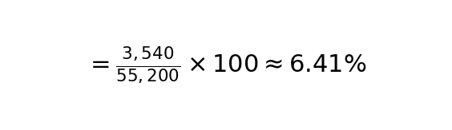

## 1. 개요

오늘 SK텔레콤(`017670`)의 최근 주가가 `53,900`원으로 마감했다. 이럴 때 장기 투자자라면 `이 가격대에서 배당수익률을 감안하면 추가 하락이 제한적이지 않을까?`라는 고민을 하게 된다. 오늘은 SK텔레콤의 연간 배당금과 주가를 기준으로, 투자자들이 실제로 저점 매수에 나서는 `배당 방어선`이 어디쯤인지 구체적으로 계산해보자. 

## 2. SK텔레콤의 배당 방어선은?

### 2.1 SK텔레콤 연간 배당금과 현재 배당수익률

- **2024~2025년 기준 연간 배당금:** 3,540원(주당)
- **현재 주가(2025.7월):** 53,900원

배당수익률 계산법:

즉, 지금 SK텔레콤을 사면 연 `6.57%`의 배당수익률을 기대할 수 있다.

### 2.2 시장에서 `배당 방어선`으로 보는 구간은?

SK텔레콤처럼 배당이 확실한 대형주는, 배당수익률이 `7%`에 근접하면 저가 매수세가 유입되는 경향이 있다. 실제로 2024년 하반기, 여러 악재로 주가가 `50,400`원까지 밀렸을 때도, 배당수익률 `7%` 선에서 강한 반등이 나왔다.

**배당수익률 7% 기준 주가 계산:**

즉, `50,600`원 부근이 시장에서 `배당 방어선`으로 인식된다는 의미다.

## 3. 투자자들이 참고할 점

- **배당수익률 7% 구간(주가 약 50,600원)**은 장기 투자자, 연금 투자자, 기관 매수세가 강해지는 구간이다
- 현 주가(53,900원)도 배당수익률 6.57%로 충분히 매력적이지만, 만약 추가 하락이 온다면 50,600원 부근에서 강한 저항이 나올 가능성이 높다
- 단, 배당이 일시적으로 줄거나, 기업 펀더멘털에 중대한 변화가 생기면 이 방어선도 무너질 수 있다

## **4. 결론 : SK텔레콤의 배당 방어선은?**

- **배당수익률 7% 구간(주가 약 50,600원)이 심리적 저점, 즉 방어선으로 작용**
- 현 주가(53,900원)도 장기 배당투자 관점에서는 충분히 매력적
- 추가 하락 시 50,600원 부근에서 저가 매수세 유입 가능성 높음

**실전 투자 Tip**

- 배당주 투자는 단기 주가 변동성보다, 배당의 안정성과 장기 수익률에 초점을 맞추는 것이 좋다
- 배당수익률이 7%를 넘는 구간에서는 분할매수 전략이 유효할 수 있다

이상으로 SK텔레콤의 배당수익률 방어선에 대해 정리했다. 궁금한 점이나 추가로 알고 싶은 내용이 있다면 언제든 댓글 남겨주세요!

---

## 3. 마무리

SK텔레콤은 안정적인 배당을 기반으로 장기 투자자와 연금 투자자들에게 꾸준히 주목받는 종목입니다. 특히 **배당수익률 7%에 해당하는 주가 약 50,600원 부근은 심리적 지지선**이자 **기관 및 장기 투자자들의 매수세가 유입될 가능성이 높은 가격대**입니다.

현 주가(54,100원) 기준 배당수익률도 6.5% 수준으로 충분히 매력적이며, 향후 시장 조정이 올 경우 해당 방어선 근처에서 **분할 매수 전략**을 고려해볼 수 있습니다.

다만, 배당이 감소하거나 펀더멘털에 부정적인 변화가 생길 경우 이 지지선도 무너질 수 있으므로 **기업 실적과 배당 정책에 대한 지속적인 모니터링이 중요**합니다.

배당주 투자의 핵심은 단기 가격 움직임보다는 **배당의 안정성과 장기적인 수익률**입니다. 특히 **배당수익률 7%를 넘는 구간에서는 보수적이지만 효과적인 분할매수 전략**이 유효할 수 있습니다.

SK텔레콤처럼 **현금흐름이 안정적인 고배당주는 장기 포트폴리오의 핵심 축**이 될 수 있습니다. 향후에도 배당 투자 전략에 도움이 될 수 있는 정보들을 꾸준히 다룰 예정이니 관심 있게 지켜봐 주세요. 궁금한 점은 언제든 댓글로 남겨주세요!

