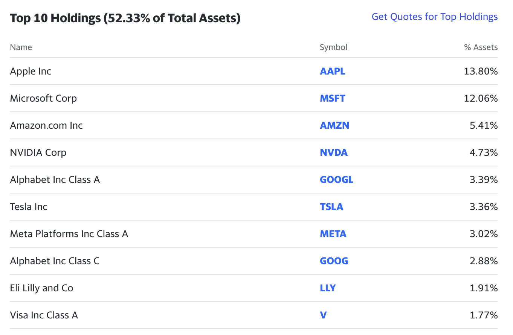
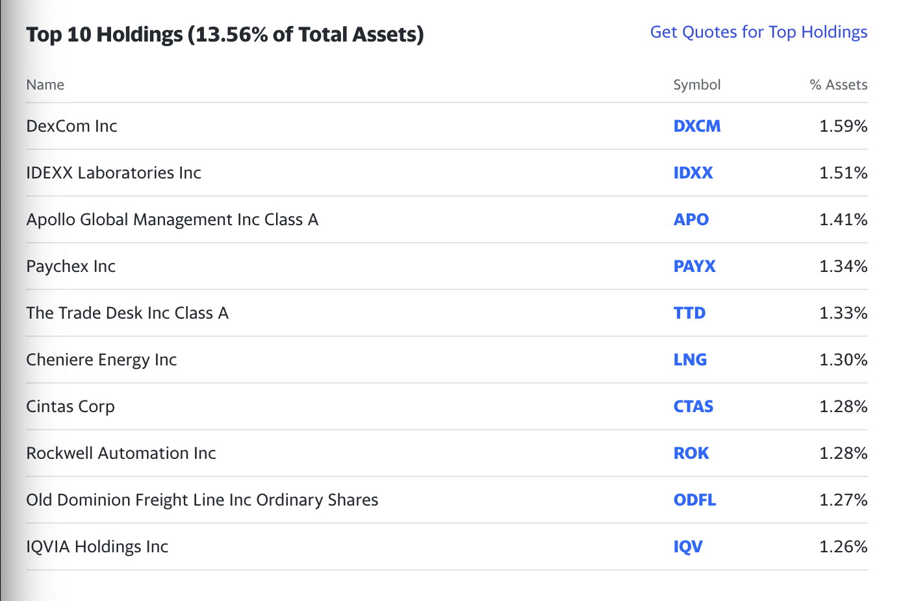
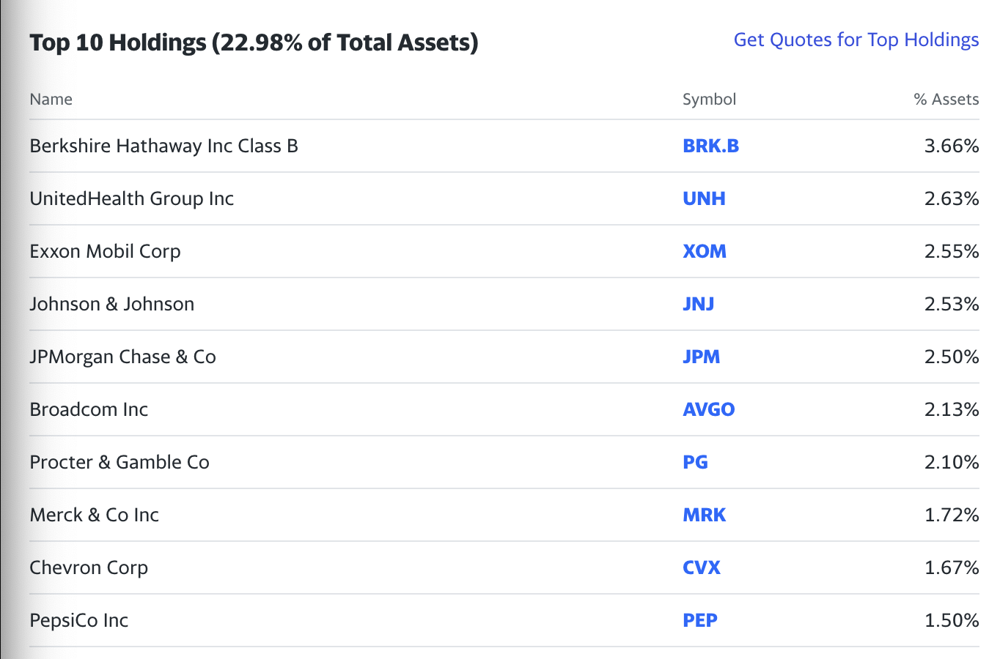
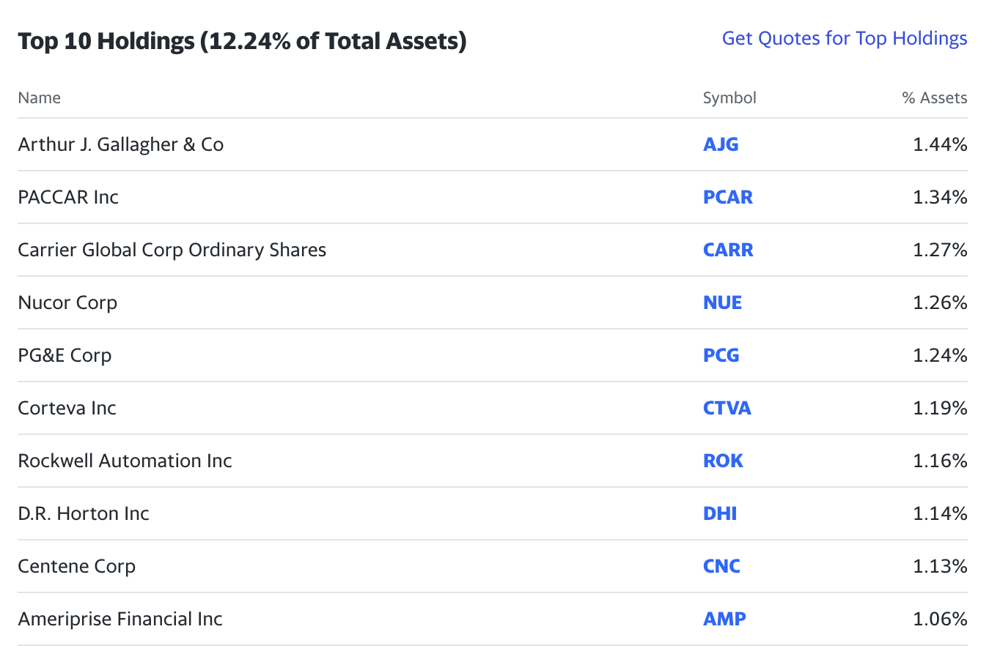

## 1.`성장주`와 `가치주`의 차이점

주식 시장에서 `성장주`와 `가치주`는 투자자들에게 두 가지 다른 접근 방식을 제공한다. `성장주`는 미래 성장 가능성을 기반으로 주식을 선택하는 반면, `가치주`는 저평가된 주식을 찾아 투자하는 전략이다. 각 주식 스타일의 특징을 살펴보자.

### 1.1 `성장주` (Growth Stocks)

`성장주`는 주식 시장에서 미래에 높은 수익성과 성장 가능성을 가진 기업의 주식을 지칭한다. 이러한 기업들은 현재 수익이 크게 나오지 않더라도 향후에 높은 성장률을 기대하는 경우가 많다. `성장주`는 주로 혁신적인 기술 및 새로운 시장 개척을 통해 성장하는 기업들을 포함한다.

#### 주요 특징

- 높은 수익성과 수익 성장률을 기대하는 기업 주식
- 기업의 혁신, 새로운 시장 개척, 차별화된 제품 및 서비스 등을 통한 성장
- 대부분의 이익을 투자 및 성장에 투자하므로 배당금 지급이 적은 경우가 많음
- 고주가 대비 높은 주가 수준을 보일 수 있음

### 1.2 `가치주` (Value Stocks)

`가치주`는 주식 시장에서 현재 주가가 기업의 실제 가치에 비해 저평가되어 있는 주식을 말한다. `가치주`는 안정적이며 예상 수익이 예측 가능한 기업들을 중심으로 구성된다. 이러한 주식들은 현재 시장에서 과소평가된 경우로, 향후에 가치가 인정받을 것으로 예상된다.

#### 주요 특징

- 현재 주가가 기업의 기본 가치에 비해 저렴한 경우
- 안정적이며 예상 수익이 상대적으로 예측 가능한 기업
- 일정 수준의 배당금을 지급하는 경우가 많음
- 주가 상승을 기대하는 것보다는 안정적인 투자 수익을 중시하는 투자자에게 인기

#### `성장주`와 `가치주`의 주요 차이점

1. **투자 목표의 차이**
    - `성장주`: 주가 상승에 초점을 맞춘 투자. 미래 성장 가능성을 중요시하여 주가 상승을 기대
    - `가치주`: 상대적으로 저렴한 가격에 구매하여 가치의 인정으로 주가 상승을 기대
2. **기업 특성**
    - `성장주`: 기업의 미래 성장 가능성을 중시하며, 혁신과 차별화된 제품, 서비스로 성장
    - `가치주`: 안정적이며 예측 가능한 수익성을 가진 기업을 선호
3. **수익성과 리스크**
    - `성장주`: 높은 수익과 성장률을 기대하지만, 투자 리스크도 상대적으로 높음
    - `가치주`: 안정적이고 예상 수익이 상대적으로 예측 가능하지만, 성장률은 낮을 수 있음
4. **배당금 지급**
    - `성장주`: 주로 이익을 재투자하므로 배당금이 적은 경우가 많음
    - `가치주`: 상대적으로 안정된 이익을 기반으로 일정 수준의 배당금을 지급하는 경우가 많음

## 2. ETF `성장주`와 `가치주`는 어떻게 구성되어 있나?

`성장주`와 `가치주`에 대한 차이점을 알아보았고 ETF 기준으로 성장주와 가치주는 어떻게 구성되어 있는지 미국 ETF로 살펴보자. `성장주`와 `가치주`에도 대형주과 중형주로 나뉜다. 대형주와 중형주는 기업의 크기와 시가총액을 기준으로 분류되는 주식 시장의 두 가지 주요 분류이다.

#### 대형주 (Large-Cap Stocks)

대형주는 시가총액이 상당히 큰 기업들의 주식을 말한다. 이러한 기업들은 종종 주식 시장에서 주목받는 대표적인 기업들로, 안정적이며 예측 가능한 수익을 가진 경우가 많다. 대형주는 성장과 가치 두 가지 스타일의 주식으로 분류될 수 있다.

#### 중형주 (Mid-Cap Stocks)

중형주는 대형주와 소형주 사이에 위치하는 기업들의 주식을 말한다. 이러한 기업들은 대형주보다는 작지만, 높은 성장 가능성을 가진 경우가 많다. 중형주는 주식 시장에서 안정적인 성과와 더 높은 주가 상승 가능성을 추구하는 투자자에게 인기가 있다.

### 2.1 미국 ETF 성장주와 가치주

#### 2.1.1 성장주

##### 2.1.1.1 대형성장: `VUG` (Vanguard Growth ETF)

`VUG` ETF는 대형기업 중에서 높은 성장률을 기대하는 기업들의 주식으로 구성된다. 주로 기술 기업과 혁신 분야의 기업들이 포함되어 있다. `VUG` ETF의 특징은 다음과 같습니다.

- 주식 종목의 예시: Apple, Microsoft, Amazon
- 기업의 혁신과 성장 가능성이 큰 기업들이 주로 구성된다
- 주가 상승을 기대하지만, 높은 변동성도 고려해야 한다

##### 2.1.1.2 중형성장: `IWP` (iShares Russell Mid-Cap Growth ETF)

`IWP` ETF는 중형기업 중에서 높은 성장률을 기대하는 기업들의 주식으로 구성된다. 중형 기업들의 성장 가능성을 중시하는 특징을 가지고 있다.

- 주식 종목의 예시: Etsy, Snap, Twilio
- 중형 규모의 기업 중에서도 성장 가능성이 큰 기업들로 구성된다
- 높은 수익을 추구하지만, 주가 변동성이 상대적으로 낮을 수 있다

#### 2.1.2 가치주

##### 2.1.2.1 대형가치: `VTV` (Vanguard Value ETF)

`VTV` ETF는 대형기업 중에서 저평가된 주식들을 포함하고 있다. 안정적이며 예상 수익이 상대적으로 예측 가능한 기업들이 주로 구성된다. `VTV` ETF의 특징은 다음과 같습니다.

- 주식 종목의 예시: Berkshire Hathaway, Johnson & Johnson, Procter & Gamble Company
- 현재 주가가 기업의 가치에 비해 저렴하게 평가된 기업들이 포함된다
- 안정적인 성과와 일정 수준의 배당금을 추구하는 투자자에게 적합한다

##### 2.2.2.2 중형 가치: VOE (Vanguard Mid-Cap Value ETF)

`VOE` ETF는 중형기업 중에서 저평가된 가치주들로 구성된다. 중형 기업들 중에서도 안정적인 수익을 추구하는 투자자에게 맞는 선택지이다.

- 주식 종목의 예시: Mohawk Industries., Lincoln National Corporation, Mosaic
- 중형 가치주 중에서 안정적인 성과와 저평가된 주식들을 중심으로 구성된다
- 주가 변동성이 낮아 상대적으로 예측 가능한 리스크를 가진다

### 2.2 ETF 성장주와 가치주의 주식 종목 Top 10

각 ETF의 Top 10 주식 종목이다.

- [**VUG (대형성장 ETF) - Vanguard Growth ETF:**](https://finance.yahoo.com/quote/VUG/holdings/)

- [**IWP (중형성장 ETF) - iShares Russell Mid-Cap Growth ETF:**](https://finance.yahoo.com/quote/IWP/holdings?p=IWP)

- [**VTV (대형가치 ETF) - Vanguard Value ETF:**](https://finance.yahoo.com/quote/VTV/holdings?p=VTV)

- **VOE (중형 가치 ETF) - Vanguard Mid-Cap Value ETF:**

## 정리

위 내용을 바탕으로, 미국의 성장주와 가치주 ETF의 차이와 각 ETF의 특징을 분석해보았다. 투자자는 자신의 투자 목표와 성향에 따라 이러한 ETF 중에서 선택할 수 있으며, 각 ETF의 구성 종목을 살펴보면서 더 나은 투자 결정을 내릴 수 있을 것이다.

## 참고

- https://finance.yahoo.com
