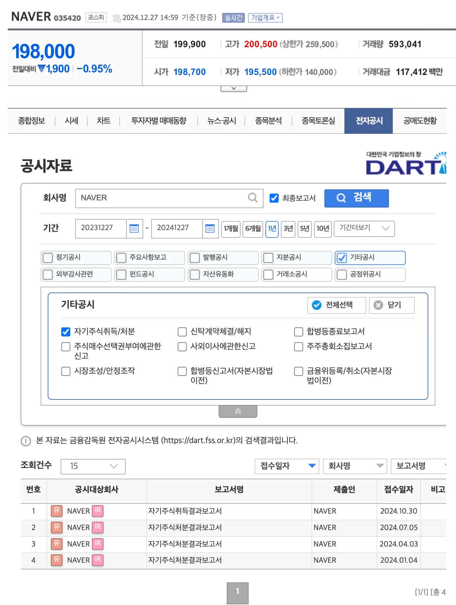
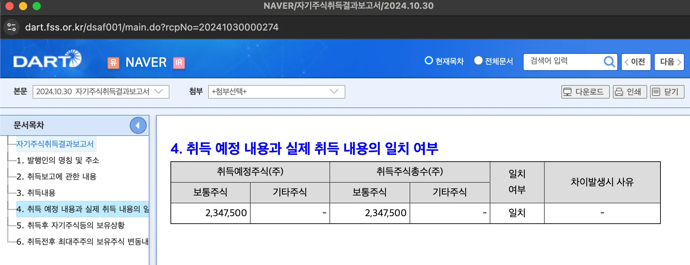
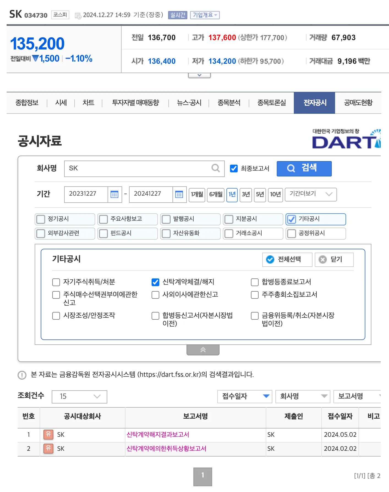
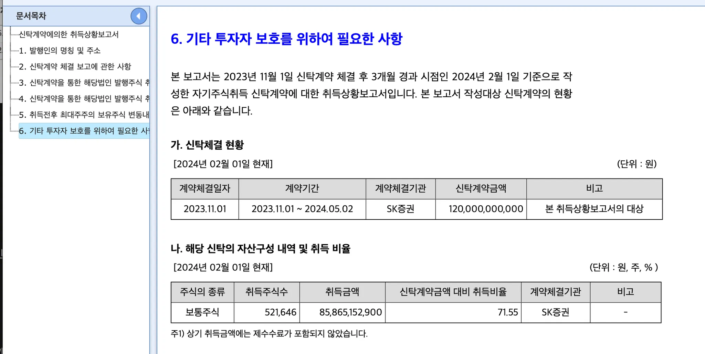
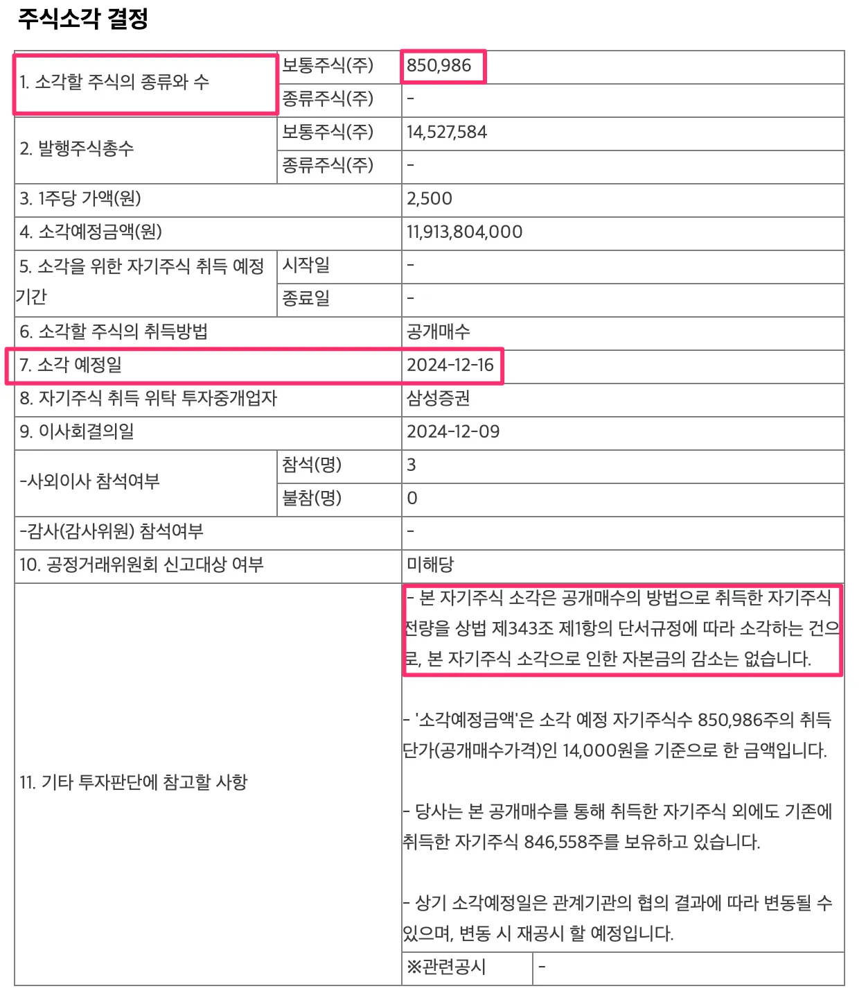

## 1. 개요

주식 시장에서 `자사주`라는 용어를 자주 접하게 된다. `자사주`는 기업이 발행한 주식 중, 그 기업 스스로 다시 매입하여 보유하는 주식을 말한다. 즉, 회사 자신이 보유한 자기 주식이라고 볼 수 있다. 이번 글에서는 `자사주`의 개념부터 취득 방법, 목적, 그리고 장단점까지 살펴보자.

## 2. `자사주`란 (Treasury Stock)

### 2.1 `자사주` 목적

기업들이 `자사주`를 취득하는 이유는 다양하다.

1. 주가 안정
    - 시장 상황이 좋지 않을 때, 기업이 `자사주`를 매입하면 매수가 증가해서 주가도 당연히 상승하는 효과를 주게 된다
2. 주주가치 제고
    - `자사주`를 매입한 후 소각하면 유통 주식 수가 줄어들어 기존 주주들의 가치가 높아진다
3. 임직원에 대한 성과급 지급
    - `자사주`를 임직원 성과 보상의 일환으로 제공하기도 한다. 이는 회사 내부에서 동기 부여와 참여를 유도한다
4. 합병 및 인수 대가로 지급
    - 합병이나 기업 인수 과정에서 `자사주`를 지분 교환의 대가로 활용하기도 한다

### 2.2 `자사주` 취득 방법

기업이 `자사주`를 취득할 때는 주로 두 가지 방법이 있다.

|           | 자기주식취득                                                 | 신탁계약                                                     |
| --------- | ------------------------------------------------------------ | ------------------------------------------------------------ |
| 취득 방법 | 회사가 직접 주식을 매입                                      | 게약을 맺은 증권사가 기업을 대신해서 주식을 매입             |
| 취득 기간 | 3개월 이내로 반드시 매수                                     | 6개월 ~ 1년 내 계약에 따라 매수                              |
| **장점**  | 비용이 적고 간편                                             | 신탁회사에 위탁하여 매입의 투명성과 안정성 확보              |
| **단점**  | 시장에 직접 개입, 주가 변동성 가능성                         | 신탁 수수료 발생, 일정 금액을 미리 신탁해야 함               |
| 추가 설명 | - 취득 후 6개월간 처분 금지 - 처분 후 3개월 간 취득 금지 -공시한 수량만큼 반드시 취득 | - 취득 후 1개월간 처분 금지 -처분 후 1개월간 취득 금지 - 계약기간 종료 후 계약 연장 혹은 해지 가능 |

자기주식취득은 신탁계약에 비해 강제성이 높은 편이다. 하지만 주가 측면에서는 신탁계약보다 자기주식취득이 더 긍정적인 영향을 미치는 경향이 있다.

### 2.3 공시 사례

기업이 `자사주`를 취득하기로 결정하면, 공시를 통해 이를 알린다.

#### 2.3.1 자기주식취득 - NAVER의 자기주식취득 결정 공시

공시에는 다음과 같은 정보가 포함되어 있다.

- 취득기간
- 취득 예정 주식

NAVER에서는 올해 2024/10/02 ~ 2024/10/25 까지 총 2,347,500 개의 자기주식을 매수했다는 것을 확인할 수 있다.

#### 2.3.2 신탁계약 - SK의 자기주식취득 신탁계약 체결 결정 공시

SK의 자기주식취득 신탁계약 방식으로 체결된 공시이다.

2023년 11월부터 7개월간 1,200억 원 규모의 주식을 SK 증권이 자유롭게 매수한다는 내용이 담겨있다.

### 2.4 `자사주`의 장단점

`자사주`는 기업과 주주에게 여러 이점을 제공하지만, 동시에 단점도 존재한다.

#### **장점**

- 유통주식수 감소자사주가 유통주식수에서 제외되므로, 주당 가치가 상승하고 주주들에게 긍정적인 영향을 미칠 수 있다
- 주가 안정 효과자사주 매입은 주가 안정화에 도움을 준다

> 유통주식수 한 기업의 총 발행 주식 중에서 실제로 시장에서 거래될 수 있는 주식의 수를 의미한다. 즉, 주주들(개인 투자자, 기관 투자자, 외국인 투자자 등)이 사고팔 수 있는 주식이다. 유통주식수는 기업의 지배구조와 투자 활동에 중요한 영향을 미치며, 주식시장에서의 유동성을 판단하는 데 중요한 요소로 작용한다.

#### **단점**

- 의결권 제한자사주는 의결권이 없는 주식으로 간주되며, 경영 참여에는 사용할 수 없다

### 2.5 `자사주`를 없애는 방법 - 소각주

기업은 `자사주`를 매입한 후 이를 소각하여 유통주식수를 줄일 수 있다. 이를 `자사주` 소각이라고 하는데, 말 그대로 `자사주`를 불에 태워서 없애는 것이다. 소각된 `자사주`는 더 이상 시장에서 거래되지 않으며, 이는 주식 가치를 높이는 효과를 가져온다.

#### 2.5.1 소각주 - 그래디언트의 자기주식취득 후 소각 결정

> 보고서명은 `주식소각결정`인데, 일단 네이버 금융 사이트에서는 주식소각결정만 쉽게 검색할 수 있는 부분은 찾지 못했다. 혹시 알고 계신 분은 댓글로 남겨주세요.

공시에서 확인할 수 있는 내요은 고각할 주식 수, 소각 예정일을 확인할 수 있다. 그래디언트 기업은 2024/12/16에 850,986의 주식을 소각했다는 것을 알 수 있다.

## 3. 마무리

`자사주`는 기업이 주주 가치를 제고하고 주가를 안정화시키기 위한 강력한 도구로 활용된다. 하지만, `자사주` 취득에는 재무적 부담과 의결권 제한과 같은 단점도 존재하므로, 투자자들은 공시 내용을 잘 분석하여 기업의 의도를 파악하는 것이 중요하다.

`자사주`는 기업의 경영 전략과 주주 환원 정책을 이해하는 데 중요한 요소이므로, 이를 잘 활용하면 더 나은 투자 판단을 내릴 수 있을 것이다.

## 4. 참고

- [자사주 매입 & 소각 - 주주환원정책](https://jatechpedia.tistory.com/60)
