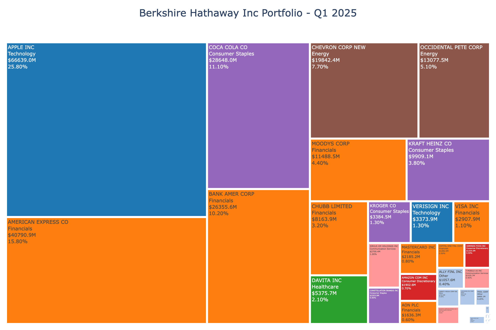
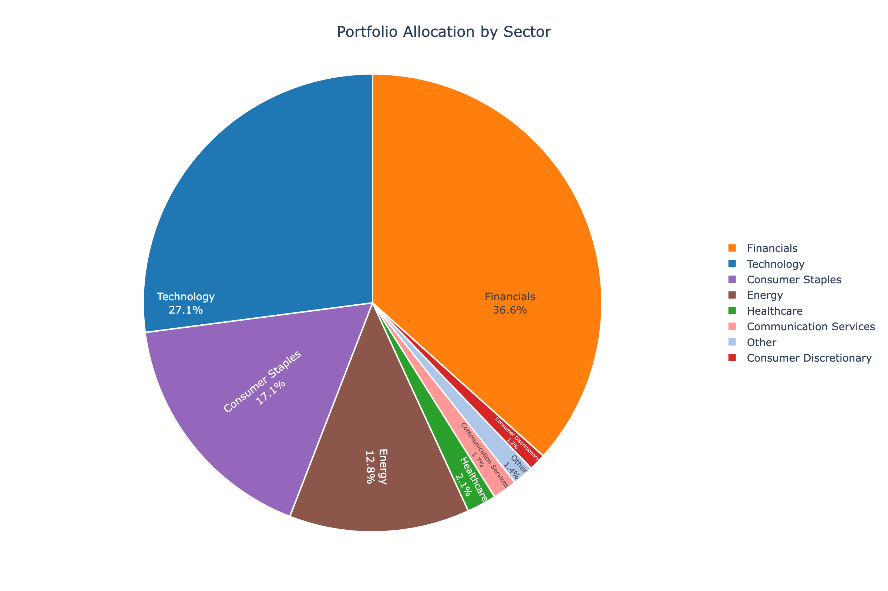

# 13F Portfolio Analysis Report

**Company**: Berkshire Hathaway Inc  
**Quarter**: Q1 2025  
**Generated**: 2025-07-05 23:38:16

---

## Executive Summary

- **Total Portfolio Value**: $258,701,128,000
- **Number of Positions**: 36
- **Top 10 Concentration**: 89.2%
- **Largest Position**: APPLE INC (25.8%)

## Portfolio Metrics

### Concentration Analysis
- **Top 5 Holdings Weight**: 70.6%
- **Top 20 Holdings Weight**: 97.9%
- **Herfindahl-Hirschman Index (HHI)**: 1285.2800
- **Effective Number of Positions**: 0.0
- **Gini Coefficient**: 0.757

### Sector Allocation

| Sector | Weight (%) |
|--------|------------|
| Financials | 36.60% |
| Technology | 27.10% |
| Consumer Staples | 17.10% |
| Energy | 12.80% |
| Healthcare | 2.10% |
| Communication Services | 1.70% |
| Other | 1.40% |
| Consumer Discretionary | 1.20% |

## Top 20 Holdings

| Rank | Security | Shares | Value | Weight (%) |
|------|----------|--------|-------|------------|
| 1 | APPLE INC | 300,000,000 | $66639.0M | 25.80% |
| 2 | AMERICAN EXPRESS CO | 151,610,700 | $40790.9M | 15.80% |
| 3 | COCA COLA CO | 400,000,000 | $28648.0M | 11.10% |
| 4 | BANK AMER CORP | 631,573,531 | $26355.6M | 10.20% |
| 5 | CHEVRON CORP NEW | 118,610,534 | $19842.4M | 7.70% |
| 6 | OCCIDENTAL PETE CORP | 264,941,431 | $13077.5M | 5.10% |
| 7 | MOODYS CORP | 24,669,778 | $11488.5M | 4.40% |
| 8 | KRAFT HEINZ CO | 325,634,818 | $9909.1M | 3.80% |
| 9 | CHUBB LIMITED | 27,033,784 | $8163.9M | 3.20% |
| 10 | DAVITA INC | 35,142,479 | $5375.7M | 2.10% |
| 11 | KROGER CO | 50,000,000 | $3384.5M | 1.30% |
| 12 | VERISIGN INC | 13,289,880 | $3373.9M | 1.30% |
| 13 | VISA INC | 8,297,460 | $2907.9M | 1.10% |
| 14 | SIRIUS XM HOLDINGS INC | 119,776,692 | $2700.4M | 1.00% |
| 15 | CONSTELLATION BRANDS INC | 12,009,000 | $2203.9M | 0.90% |
| 16 | MASTERCARD INC | 3,986,648 | $2185.2M | 0.80% |
| 17 | AMAZON COM INC | 10,000,000 | $1902.6M | 0.70% |
| 18 | AON PLC | 4,100,000 | $1636.3M | 0.60% |
| 19 | CAPITAL ONE FINL CORP | 7,150,000 | $1282.0M | 0.50% |
| 20 | DOMINOS PIZZA INC | 2,620,613 | $1204.0M | 0.50% |

## Visualizations

The following visualizations have been generated:

1. **Portfolio Treemap** (`portfolio_treemap.png`): Treemap showing all holdings sized by market value
2. **Sector Allocation Pie Chart** (`sector_allocation.png`): Breakdown of portfolio by sector
3. **Top Holdings Bar Chart** (`top_holdings.png`): Bar chart of top 20 holdings by weight

### Portfolio Treemap

### Sector Allocation

### Top Holdings

## Analysis Notes

- **High Concentration**: The portfolio shows high concentration (HHI = 1285.280), indicating significant weight in top positions.
- **Dominant Position**: APPLE INC represents 25.8% of the portfolio.

---

*This report was automatically generated from 13F filing data available at [13f.info](https://13f.info)*
