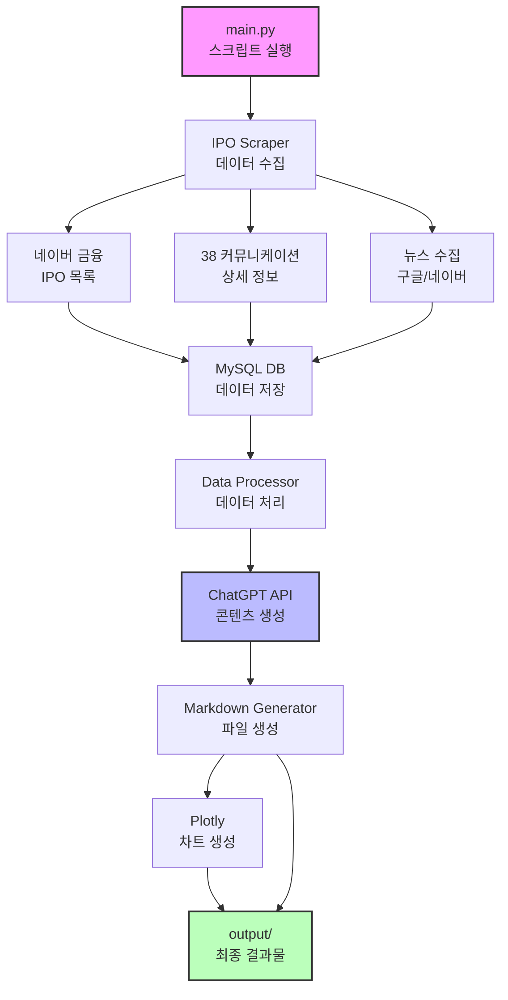
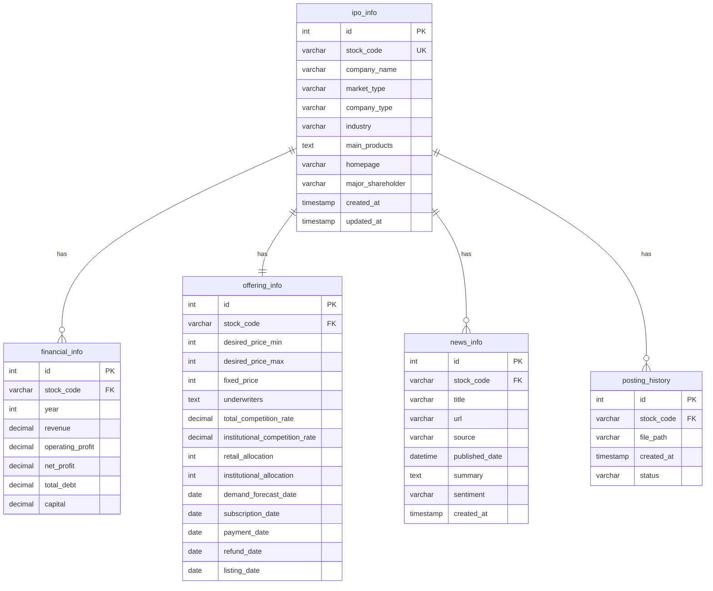

# IPO 블로그 자동화 시스템 설계 문서

## 1. 시스템 아키텍처

### 1.1 전체 구조




위 다이어그램은 전체 시스템의 데이터 흐름을 보여줍니다. 

### 1.2 주요 컴포넌트
- **IPO Scraper**: 웹 스크래핑을 통한 데이터 수집
- **MySQL Database**: 수집된 데이터 및 포스팅 이력 저장
- **Data Processor**: 수집된 데이터 가공 및 검증
- **ChatGPT Integration**: 블로그 콘텐츠 생성
- **Markdown Generator**: 최종 블로그 포스팅 생성
- **Chart Generator**: 재무 데이터 시각화

## 2. 데이터베이스 설계

### 2.1 ER 다이어그램



### 2.2 테이블 관계 설명

- **ipo_info**: 모든 IPO 정보의 중심 테이블 (마스터)
- **financial_info**: 연도별 재무 정보 (1:N 관계)
- **offering_info**: 공모 상세 정보 (1:1 관계)
- **news_info**: 뉴스 정보 (1:N 관계)
- **posting_history**: 포스팅 생성 이력 (1:N 관계)

### 2.3 테이블 구조

```sql
-- IPO 정보 테이블
CREATE TABLE ipo_info (
    id INT AUTO_INCREMENT PRIMARY KEY,
    stock_code VARCHAR(10) UNIQUE NOT NULL,
    company_name VARCHAR(100) NOT NULL,
    market_type VARCHAR(20),
    company_type VARCHAR(50),
    industry VARCHAR(100),
    main_products TEXT,
    homepage VARCHAR(255),
    major_shareholder VARCHAR(100),
    created_at TIMESTAMP DEFAULT CURRENT_TIMESTAMP,
    updated_at TIMESTAMP DEFAULT CURRENT_TIMESTAMP ON UPDATE CURRENT_TIMESTAMP
);

-- 재무 정보 테이블
CREATE TABLE financial_info (
    id INT AUTO_INCREMENT PRIMARY KEY,
    stock_code VARCHAR(10) NOT NULL,
    year INT NOT NULL,
    revenue DECIMAL(15,2),
    operating_profit DECIMAL(15,2),
    net_profit DECIMAL(15,2),
    total_debt DECIMAL(15,2),
    capital DECIMAL(15,2),
    FOREIGN KEY (stock_code) REFERENCES ipo_info(stock_code),
    UNIQUE KEY unique_stock_year (stock_code, year)
);

-- 공모 정보 테이블
CREATE TABLE offering_info (
    id INT AUTO_INCREMENT PRIMARY KEY,
    stock_code VARCHAR(10) NOT NULL,
    desired_price_min INT,
    desired_price_max INT,
    fixed_price INT,
    underwriters TEXT,
    total_competition_rate DECIMAL(10,2),
    institutional_competition_rate DECIMAL(10,2),
    retail_allocation INT,
    institutional_allocation INT,
    demand_forecast_date DATE,
    subscription_date DATE,
    payment_date DATE,
    refund_date DATE,
    listing_date DATE,
    FOREIGN KEY (stock_code) REFERENCES ipo_info(stock_code)
);

-- 뉴스 정보 테이블
CREATE TABLE news_info (
    id INT AUTO_INCREMENT PRIMARY KEY,
    stock_code VARCHAR(10) NOT NULL,
    title VARCHAR(500),
    url VARCHAR(500),
    source VARCHAR(50),
    published_date DATETIME,
    summary TEXT,
    sentiment VARCHAR(20),
    created_at TIMESTAMP DEFAULT CURRENT_TIMESTAMP,
    FOREIGN KEY (stock_code) REFERENCES ipo_info(stock_code)
);

-- 포스팅 이력 테이블
CREATE TABLE posting_history (
    id INT AUTO_INCREMENT PRIMARY KEY,
    stock_code VARCHAR(10) NOT NULL,
    file_path VARCHAR(500),
    created_at TIMESTAMP DEFAULT CURRENT_TIMESTAMP,
    status VARCHAR(20) DEFAULT 'completed',
    FOREIGN KEY (stock_code) REFERENCES ipo_info(stock_code)
);
```

## 3. 모듈 설계

### 3.1 디렉토리 구조
```
ipo-blog/
├── config/
│   └── config.py          # 환경변수 및 설정 관리
├── db/                    # Liquibase 데이터베이스 관리
│   ├── changelog/
│   │   ├── db.changelog-master.xml
│   │   ├── changes/
│   │   │   ├── 001-create-tables.xml
│   │   │   ├── 002-add-indexes.xml
│   │   │   └── 003-insert-initial-data.xml
│   │   └── rollback/
│   └── liquibase.properties
├── scrapers/
│   ├── __init__.py
│   ├── base_scraper.py    # 기본 스크래퍼 클래스
│   ├── naver_scraper.py   # 네이버 금융 스크래퍼
│   ├── comm38_scraper.py  # 38 커뮤니케이션 스크래퍼
│   └── news_scraper.py    # 뉴스 스크래퍼
├── database/
│   ├── __init__.py
│   ├── connection.py      # DB 연결 관리
│   └── models.py          # DB 모델 클래스
├── processors/
│   ├── __init__.py
│   ├── data_validator.py  # 데이터 검증
│   └── data_processor.py  # 데이터 가공
├── generators/
│   ├── __init__.py
│   ├── content_generator.py  # ChatGPT 콘텐츠 생성
│   ├── markdown_generator.py # Markdown 생성
│   └── chart_generator.py    # 차트 생성
├── utils/
│   ├── __init__.py
│   └── logger.py          # 로깅 유틸리티
├── output/                # 생성된 블로그 포스팅
├── logs/                  # 로그 파일
├── requirements.txt       # 의존성 패키지
└── main.py               # 메인 실행 파일
```

### 3.2 주요 클래스 설계

```python
# base_scraper.py
class BaseScraper:
    def __init__(self):
        self.session = requests.Session()
        self.headers = {
            'User-Agent': 'Mozilla/5.0 (Windows NT 10.0; Win64; x64) AppleWebKit/537.36'
        }
    
    def get_soup(self, url: str) -> BeautifulSoup:
        """URL에서 BeautifulSoup 객체 생성"""
        pass
    
    def respect_robots_txt(self, url: str) -> bool:
        """robots.txt 준수 여부 확인"""
        pass

# models.py
class IPOInfo:
    def __init__(self, stock_code: str):
        self.stock_code = stock_code
        self.company_name = None
        self.market_type = None
        # ... 기타 필드
    
    def is_valid_for_posting(self) -> bool:
        """포스팅 생성 가능 여부 확인"""
        pass

# content_generator.py
class ContentGenerator:
    def __init__(self, api_key: str):
        self.client = openai.Client(api_key=api_key)
    
    def generate_blog_content(self, ipo_data: dict) -> str:
        """ChatGPT API를 사용하여 블로그 콘텐츠 생성"""
        pass
```

## 4. 데이터 흐름

### 4.1 데이터 수집 프로세스
1. **네이버 금융에서 IPO 목록 수집**
   - 지정된 증권사 필터링
   - 기본 IPO 정보 추출

2. **38 커뮤니케이션에서 상세 정보 수집**
   - 기업명으로 검색
   - 재무 정보, 공모 상세 정보 추출

3. **뉴스 수집**
   - 구글, 네이버에서 최대 4개 뉴스 수집
   - 제목, URL, 요약 저장

### 4.2 데이터 처리 프로세스
1. **데이터 검증**
   - 필수 필드 확인
   - 데이터 형식 검증
   - 중복 확인 (종목코드 기준)

2. **데이터 저장**
   - MySQL DB에 저장
   - 트랜잭션 처리로 데이터 일관성 보장

3. **콘텐츠 생성**
   - 수집된 데이터를 구조화
   - ChatGPT API 호출하여 블로그 콘텐츠 생성
   - 뉴스 감성 분석

4. **파일 생성**
   - Markdown 파일 생성
   - Plotly로 차트 생성 및 저장

## 5. API 설계

### 5.1 ChatGPT API 사용
```python
def create_blog_prompt(ipo_data: dict) -> str:
    """블로그 생성을 위한 프롬프트 구성"""
    prompt = f"""
    다음 IPO 정보를 바탕으로 블로그 포스팅을 작성해주세요.
    
    기업명: {ipo_data['company_name']}
    업종: {ipo_data['industry']}
    주요제품: {ipo_data['main_products']}
    
    다음 구조로 작성해주세요:
    1. 기업 소개 (어떤 회사인가? 뭘로 돈을 버는가?)
    2. 경쟁사 분석
    3. 투자 포인트
    
    톤앤매너: 전문적이면서도 이해하기 쉽게
    """
    return prompt
```

### 5.2 환경변수 설정
```bash
# .env 파일
MYSQL_HOST=localhost
MYSQL_USER=ipo_user
MYSQL_PASSWORD=password
MYSQL_DATABASE=ipo_blog
OPENAI_API_KEY=your_api_key
```

## 6. 에러 처리

### 6.1 예외 처리 전략
- **웹 스크래핑 실패**: 3회 재시도 후 실패 로깅
- **DB 연결 실패**: 연결 풀 재생성
- **API 호출 실패**: Rate limit 확인 후 재시도
- **파일 생성 실패**: 디렉토리 권한 확인

### 6.2 로깅
```python
# 로그 레벨
- DEBUG: 상세 디버깅 정보
- INFO: 일반 실행 정보
- WARNING: 경고 (데이터 누락 등)
- ERROR: 에러 발생
- CRITICAL: 심각한 에러
```

## 7. 보안 고려사항

### 7.1 데이터 보안
- 환경변수로 민감정보 관리
- SQL Injection 방지 (Prepared Statement 사용)
- API 키 노출 방지

### 7.2 웹 스크래핑 윤리
- robots.txt 준수
- 요청 간격 준수 (최소 1초)
- User-Agent 명시

## 8. 성능 최적화

### 8.1 스크래핑 최적화
- 동시 요청 제한 (최대 3개)
- 캐싱 활용
- 불필요한 리소스 다운로드 방지

### 8.2 DB 최적화
- 인덱스 설정 (stock_code)
- 배치 Insert 활용
- 연결 풀 사용

## 9. 테스트 전략

### 9.1 단위 테스트
- 각 스크래퍼 모듈 테스트
- 데이터 검증 로직 테스트
- DB 연결 테스트

### 9.2 통합 테스트
- 전체 파이프라인 테스트
- 에러 시나리오 테스트

## 10. 배포 및 운영

### 10.1 실행 방법
```bash
# 의존성 설치
pip install -r requirements.txt

# Liquibase로 DB 스키마 생성/업데이트
cd db
liquibase update

# 환경변수 설정
export MYSQL_HOST=localhost
export MYSQL_USER=ipo_user
# ... 기타 환경변수

# 실행
python main.py
```

### 10.2 모니터링
- 로그 파일 확인
- DB 상태 모니터링
- 생성된 파일 검증

## 11. Liquibase를 통한 데이터베이스 버전 관리

### 11.1 Liquibase 설정
Liquibase를 사용하여 데이터베이스 스키마 변경사항을 버전 관리합니다.

### 11.2 주요 파일
- **db.changelog-master.xml**: 마스터 changelog 파일
- **liquibase.properties**: DB 연결 정보 및 설정
- **changes/**: 개별 변경사항 파일들

### 11.3 사용 명령어
```bash
# DB 업데이트
liquibase update

# 변경사항 미리보기
liquibase updateSQL

# 롤백 (태그까지)
liquibase rollback <tag>

# 현재 상태 확인
liquibase status

# 히스토리 확인
liquibase history
```

### 11.4 새로운 변경사항 추가
1. `db/changelog/changes/` 디렉토리에 새 XML 파일 생성
2. 변경사항 작성 (테이블 생성, 컬럼 추가 등)
3. `db.changelog-master.xml`에 include 추가
4. `liquibase update` 실행

### 11.5 베스트 프랙티스
- 각 변경사항은 별도 파일로 관리
- 의미있는 파일명 사용 (예: 004-add-company-sector-column.xml)
- 롤백 스크립트 항상 포함
- 프로덕션 적용 전 테스트 환경에서 검증 